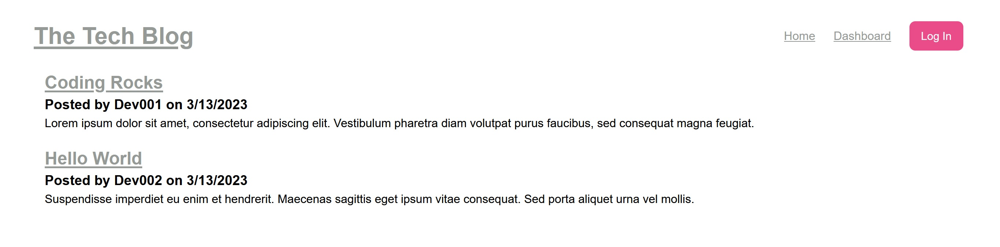

# Boot Camp - Module 14 - Model-View-Controller (MVC) Challenge: Tech Blog

## About

A CMS-style blog built following the MVC paradigm with Handlebars.js as the templating language, Sequelize as the ORM, and the express-session npm package for authentication. This coding challenge was completed for Full Stack Coding Boot Camp.

## Screenshot

## Technologies

JavaScript, Node.js, Express.js, MySQL, Seuqlize, Handlebars, Markdown, Heroku, Git, GitHub, VS Code, Chrome, Firefox

## License

This project is licensed under the MIT License.
